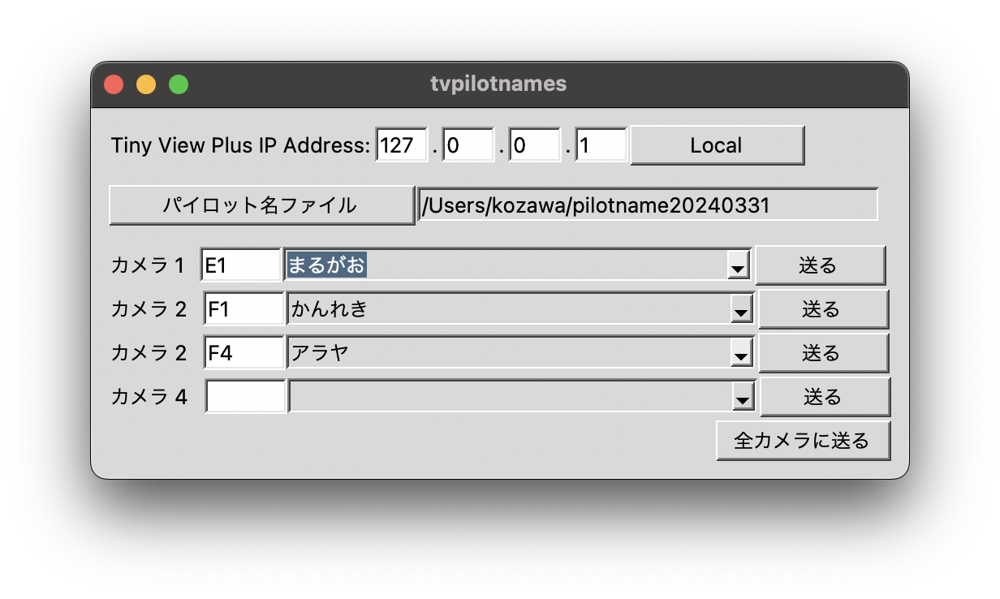

# tvpilotnames 
## Manipulate Tiny View Plues pilot name field for each cameras

***English version (program and readme) will be availabe in the near future***

### 目的
このプログラムはTiny View Plus(以下のリンク参照)に対してパイロット名を各カメラに設定するものです。
https://github.com/t-asano/tinyviewplus
Tiny View PlusとはOSCプロトコルを介して通信を行います。

### プログラムの起動
#### Python3環境での実行
1. `pip install python-osc`
2. python tvpilotnames.py

### 実行ファイルを使用する場合
MacOSおよびWindows環境で直接稼働する実行ファイルを用意しています。実行ファイルについてはReleaseページをご覧ください。

### 使用方法

1. Tiny View Plus IP Address、Tiny View Plusが稼働しているPCのIP Addressを指定する。同じPC上で実行する場合は「Local」ボタンを押すとIP Addressに127.0.0.1が設定されます。
2. パイロット名ファイルを指定します。テキストファイルであらかじめパイロット名を列挙したものを用意しておき、それを指定します。このファイルはUTF-8で記述し、各行にパイロット名を一つずつ記述したものになります。
3. カメラ[n]の横の入力欄は単なる覚書です。チャネルなどを書いておくと便利です。何も書かなくても構いません。
4. その横のセレクターでパイロット名を選択します。
5. 「送る」ボタンでTiny View Plusにパイロット名が送付されFPV映像上にパイロット名が表示されます。「全カメラに送る」ボタンを押すとカメラ1からカメラ4まで全てのパイロット名が送付されます。
